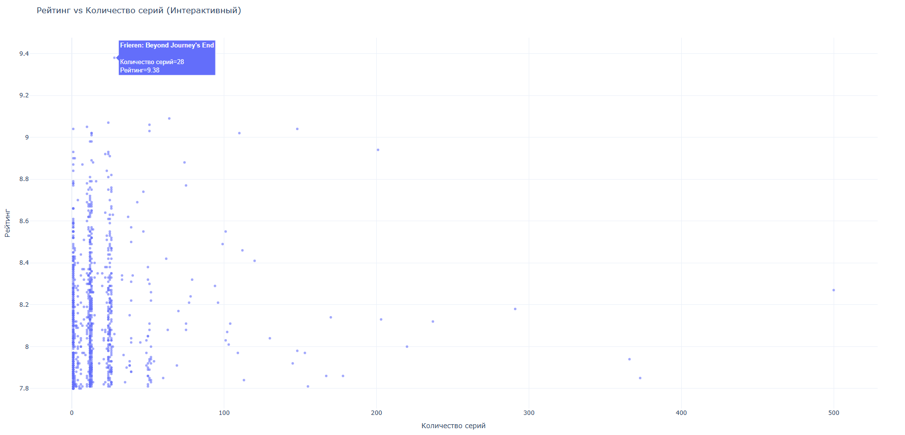

# Anime-dataframe-analysis

    <h2> Цель проекта: </h2>
    
Вычислить корреляцию между количеством эпизодов и рейтингом. 
     Узнать есть ли связь между количеством эпизодов и рейтингом, ставят ли пользователи рейтинг выше если у аниме количество серий меньше?
     Датасет взят из сайта Kaggle

 
  <h3> Инструменты, которые я использовал: </h3>
  
<strong>pandas</strong> — для чтения и обработки датафрейма.

  
<strong>plotly</strong> — для интерактивной визуализации данных и построения графиков.

 
    <h3> Трудности, с которыми я столкнулся: </h3>
    
 Скаченный датафрейм с сайта Kaggle имеет много пропусков и null значений, пришлось немного повозиться. 

 
<h2> Вывод проекта </h2>
    
 Так как корреляция между рейтингом и количеством серий равна 0.028 можно сказать, что связи нет и количество серий не влияет на рейтинг.

    

          
    

